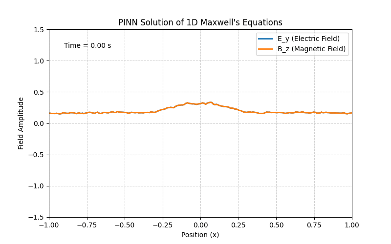

# PINN-S
# Physics-Informed Neural Network (PINN) for 1D Maxwell's Equations



## 📝 Summary

This project demonstrates a Physics-Informed Neural Network (PINN) designed to solve a fundamental problem in electromagnetism: the propagation of a 1D electromagnetic wave as described by **Maxwell's equations**.

Unlike traditional deep learning models that learn from a static dataset, this PINN learns the underlying physics directly. It is constrained by the differential equations themselves, which are embedded into the loss function. The model takes **time (t)** and **position (x)** as inputs and predicts the **Electric Field (E_y)** and **Magnetic Field (B_z)**.

This project serves as a powerful example of bridging the gap between a deep scientific background (Physics) and modern AI techniques.

## 🎯 Key Features

-   **Deep Learning Model:** A simple feed-forward neural network built with PyTorch.
-   **Physics-Informed Loss:** A custom loss function that includes terms for the initial conditions, boundary conditions, and the physical residuals of Maxwell's equations.
-   **Automatic Differentiation:** Leverages `torch.autograd` to calculate the necessary spatial and temporal derivatives required by the PDEs.
-   **No External Data:** The model is trained solely on the mathematical definition of the problem, requiring no external training data.

## 📈 Results

The trained model successfully learns the dynamics of a propagating sinusoidal electromagnetic wave.

-   **Final L2 Relative Error:** [Enter your calculated L2 error here, e.g., 0.00123]
-   The animation above shows the predicted wave propagation over time, which closely matches the known analytical solution.

## 🛠️ Technologies Used

-   Python
-   PyTorch
-   NumPy
-   Matplotlib

## 🚀 How to Run

1.  **Clone the repository:**
    ```bash
    git clone [Your GitHub Repository URL]
    cd pinn_maxwell_project
    ```

2.  **Install the required libraries:**
    ```bash
    pip install torch numpy matplotlib
    ```

3.  **Run the main script:**
    ```bash
    python main.py
    ```
    The script will start training the model. After completion, it will save the results as `em_wave_animation.gif` in the project directory.